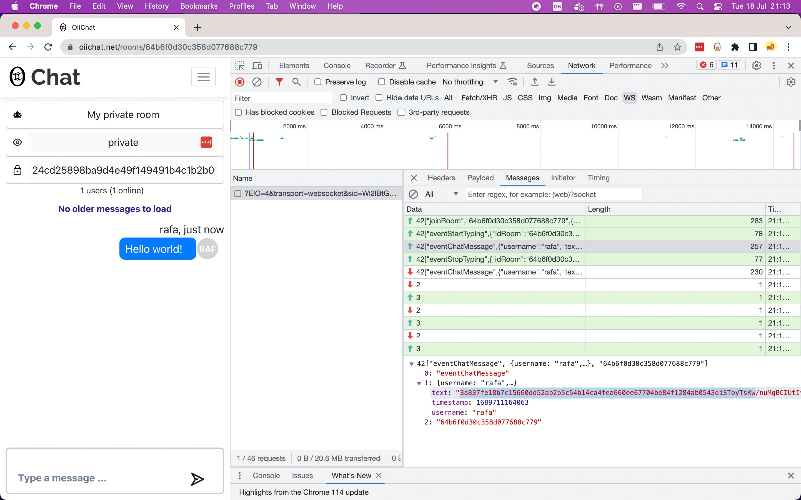
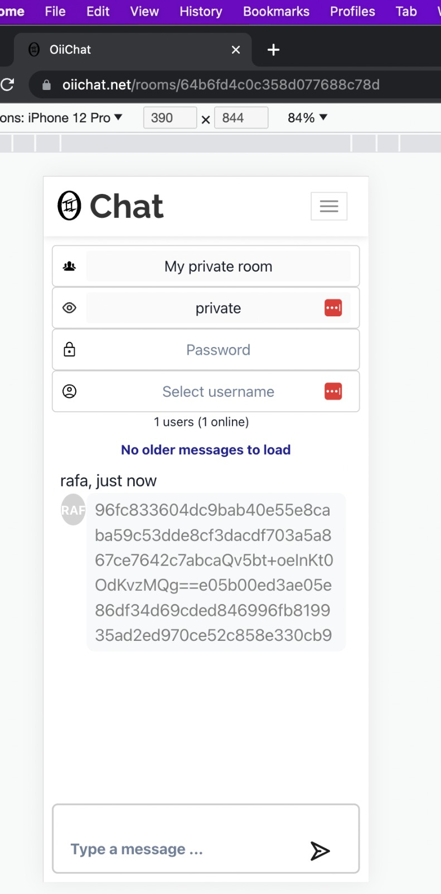
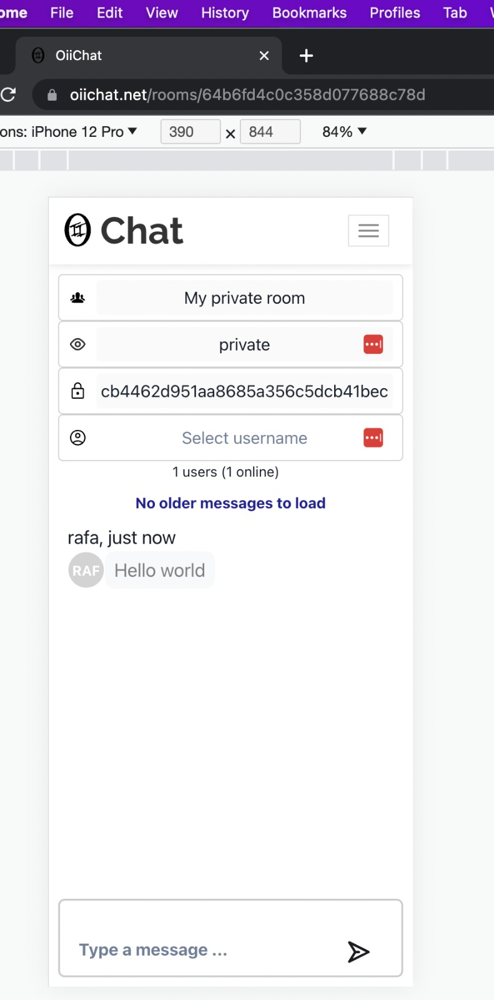

## TLDR - Too Long; Didn't Read

* This is a chat app that makes it impossible for the server to read your messages
* How? Because it's the user who chooses the encryption key
  * Also, because the code is publicly available, you can double check that the encryption key that you defined is never sent to the server 
  * This is what makes it impossible for the server to read your messages. Without the encryption key, and as long as you choose a strong password, it is virtually impossible to decrypt the messages
* So, how does it work:
  * users creates a new chat room (public or private)
  * user chooses their own encryption key for the room (for private rooms only)
  * user can then send messages which are encrypted, on your computer/phone, using your encryption key, before being sent to the server
  * user can then share a link to the chat room
    * any user who joins this room will only see encrypted messages, because this is how they are stored in the server
    * to decrypt those messages and read their contents, the user needs the rooms password, which is used to decrypt the messages on your phone

---

## Long Story Long

Below I explain why I built this project, and I detail exactly how it works, particularly when it comes to the encryption feature, which is the main difference between this app and most other chat apps out there.
So, let's jump right in.

**Table of contents:**

- [TLDR - Too Long; Didn't Read](#tldr---too-long-didnt-read)
- [Long Story Long](#long-story-long)
- [Motivation](#motivation)
- [What I built](#what-i-built)
- [How it works, high level overview](#how-it-works-high-level-overview)
  - [Journey 1 - Create a chat Room](#journey-1---create-a-chat-room)
  - [Journey 2 - Inviting someone to a Chat](#journey-2---inviting-someone-to-a-chat)
    - [Private Rooms:](#private-rooms)
    - [Public Rooms:](#public-rooms)
  - [Journey 3 - Sending messages](#journey-3---sending-messages)
  - [Journey 4 - Sign up](#journey-4---sign-up)
- [How it works, deep dive](#how-it-works-deep-dive)
  - [Journey 1 - Create a chat Room](#journey-1---create-a-chat-room-1)
  - [Journey 3 - Sending and receiving messages](#journey-3---sending-and-receiving-messages)
    - [Journey 3.1 - Validating the room password](#journey-31---validating-the-room-password)
    - [Journey 3.2 - Sending messages](#journey-32---sending-messages)
  - [Journey 3.3 - Receiving messages](#journey-33---receiving-messages)
  - [Journey 4 - Sign up](#journey-4---sign-up-1)
  - [Journey 4.1 - Sign In](#journey-41---sign-in)
- [How can you trust me? (Hint, you don't)](#how-can-you-trust-me-hint-you-dont)
  - [Verify that PASSWORDS\_ARE\_NOT\_STORED](#verify-that-passwords_are_not_stored)
  - [Verify that MESSAGES\_ARE\_ENCRYPTED\_USING\_YOUR\_KEY](#verify-that-messages_are_encrypted_using_your_key)
- [Notes on Security](#notes-on-security)
- [What's next](#whats-next)

---

## Motivation

WhatsApp is end-to-end encrypted, right? So... does this mean that WhatsApp can't read your messages?

Honestly, this is a question that I would like someone a lot smarter than me to try to answer. But, the way I see it is: WhatsApp (and other apps like it) control the encryption key used to encrypt your message. And because of this, this means that WhatsApp **can** ready your messages. As a user, you (and me) are trusting WhatsApp not to do so, but if they wanted to, they could. (Once again, if I am wrong about this, please do let me know, and point me to some documentation that explains why this is not the case.)

So, the question that followed after this was: is it even possible to build a ChatApp that is encrypted **and whose messages can not be read by the chat service provider**? And if so, what would that look like?

Initially, thinking about this, I thought that: "No, this isn't possible. Even if the app allows the user to select their own encryption key, the user still has to type this password inside a form that is controlled by the chat service provider, and this means that the chat service provider can read this encryption key, and abuse it, if they so desire".

After thinking some more, I also realized that: "While this may be true, **if the user can verify that their encryption key is not being sent to the server, then they can be sure that the chat service provider is not able to read the encrypted messages**" (see [this section](#how-can-you-trust-me-hint-you-dont) for more on this).

And so, I realised, it is possible to build a chat app that can **not** be abused by the chat service provider. And thus, this project was born. So, now, let's explore exactly what I build, how it is different from most chat apps, and how you can easily verify its security by yourself.

---

## What I built

* Chat App built using:
  * React and JavaScript for the frontend
  * Client Side rendered app, using S3 and Cloudfront for the distribution
  * NodeJs, Express and Socket.IO for the backend
  * MongoDB for the database
* Unique features:
  * Messages are encrypted, on the client side, using a user-provided encryption key (we will just call these rooms *passwords*)
* Other features:
  * Real-time chat
  * Public (not encrypted) and Private (encrypted) rooms
  * 1-1 messages
  * Group messages
  * Message history
  * User is typing feature
  * Signup and Login
  * User vault (to store all the rooms passwords (encrypted))
  
## How it works, high-level overview

To explain how this app works, on a high level, I will now explain the user journeys. In the section below I will recap these user journeys and explain in more details exactly what happens at each step of each.

### Journey 1 - Create a chat Room

* a User clicks on a button to create a new chat *Room* and is taken to a new page
  * the user selects a `room name`
  * the user selects the room `visibility` (`public` or `private`)
  * if the room is `private`, the user must select a `room password`
* the user clicks on the "Create Room" button
  * if there is an issue, the user is notified about the error
  * if successful, the user is redirected to the rooms page and they can start chatting

### Journey 2 - Inviting someone to a Chat

#### Private Rooms:

* Copy the URL of the room and send it to a friend (using any desired medium)
  * Upon joining the room, new joiners will only see encrypted messages
* To see decrypted messages, new joiners must type the correct room password

#### Public Rooms:

* Anyone can join a public room by navigating to it using the app itself
* Anyone can join a public room if they have a link to the room


### Journey 3 - Sending messages

* a User navigates to a room
* (if the user is not logged in) the user selects a username
* the User types a message
* the User clicks Send


### Journey 4 - Sign up

* a User clicks on a button to "Sign Up"
  * the user is redirected to a new page
* the user selects a username and password
  * if successful, the user has now signed up, is logged in, and is redirected to the home page
  * if there is an error, the app displays an error message

---

## How it works, deep dive

### Journey 1 - Create a chat Room

As above, the user journey is (copy-paste):
* a User clicks on a button to create a new chat *Room* and is taken to a new page
  * the user selects a `room name`, and `visibility` (`public` or `private`)
  * if the room is `private`, the user must select a `room password`
* the user clicks on the "Create Room" button
  * if there is an issue, the user is notified about the error
  * if successful, the user is redirected to the rooms page and they can start chatting

**Now, what happens under the hood?**

On the client side (the user's browser), the app does the following:
* the `room password` is used to encrypt a `testMessage`, resulting in an `encryptedTestMessage`
  * the `testMessage` is unique for each room and generated at run time using `uuid`
    * the `testMessage` and `encryptedTestMessage` will become relevant later, because they are used to validate if the password the user has selected is correct
* the app creates a payload to be sent to the server:
    ```javascript
    const payloadNewRoom = {
        roomName,
        visibility,
        testMessage,
        encryptedTestMessage,
        ownerId: userData?._id,
    }
    ```
* The app makes a POST request to the server to create a new room, using the above payload
  * If successful, the app receives a response that includes an `idRoom`
  * The `idRoom` is used to navigate to the newly created chat page (using React Router)

> Notice that the above payload does NOT include the room's password. This means that the server does NOT have the room password, and thus, it can not read the encrypted messages stored in the server. 

Note that:
* the above payload does NOT include the rooms password
* the payload above is sent for both public and private rooms (although the `testMessage` and the `encryptedTestMessage` have no use for the public rooms)

---

### Journey 3 - Sending and receiving messages

When the chat page loads, 
  * the app creates a `simpleCrypto` client (see [simplecrypto.org](https://simplecrypto.js.org/))
    * the `simpleCrypto` client is what allows the app to encrypt and decrypt the messages before sending them to the server
  * the app makes a request to the server to load any old messages

#### Journey 3.1 - Validating the room password

Upon joining the room for the first time, if the room is private, the messages will be encrypted. To decrypt the messages, the user has to submit the correct room password. Below we explain how this process works.

When the user types a password:
* the password is used to encrypt the `testMessage` associated to this room (see [Create Room journey](#journey-1---create-a-chat-room-1)), 
* this value is then compared to the rooms `encryptedTestMessage` 
  * if they match, the typed room password is correct
  * if they don't match, then nothing changes
  * (see `isCorrectRoomPassword` function)

When the user selects the correct password: 
  * the previous messages are decrypted, meaning that they can now be read
  * the password of the room is saved in the browser's local storage (see `saveRoomPasswordToLS` function)
    * this means that the next time you enter this room, the app can reload the rooms password without you having to type it again (notice that the server does not have access to this information)

**TLDR:** the selected password is used to encrypt a `testMessage` that is used to check if the password is correct 

#### Journey 3.2 - Sending messages

As above, the user journey is (copy paste):
* a User navigates to a room
* (if the user is not logged in) the user selects a username
* the User types a message
* the User clicks Send

**Now, what happens under the hood?**
    
When a user submits a message:
* the app uses the `simplyCrypto` client to encrypt the typed message
  ```js
  const payload = {
      username,
      text: simpleCrypto.encrypt(value),
      timestamp: Date.now(),
  };
  socket.emit("eventChatMessage", payload, roomId);
  ```
Notice that:
  * **we only send encrypted messages to the server** (for private rooms)


### Journey 3.3 - Receiving messages

**Upon receiving a live message:**

* the app uses the `simpleCrypto` client to decrypt the typed message
  ```js
  function onChatMessageEvent(event) {
      setEvents((previous) => [
      ...previous,
      decryptEvent(newSimpleCrypto, event),
      ]);
  }
  socket.on("eventChatMessage", onChatMessageEvent);
  ```
Notice that the `simpleCrypto` client has been initialized before
  * it may either have been initialized with an empty or a wrong password, in which case the decryption will fail, and the user will only be able to see encrypted value of the message, as is stored on the server
  * or, the user may have already submitted a correct password, in which case the `simpleCrypto` client has been updated to use this password, and the decryption will succeed. 

**Upon loading Message History**

The app also has the ability to display a chat history (that is, older messages). 
  * when the chat page is rendered for the first time, the app makes a request to the server to get the most recent messages
  * the user has also the option to click on a button to load older messages, if they are available. 
   
In both cases, the process is similar: load encrypted messages from the server, and decrypt them on the client side using the rooms password.  

---

### Journey 4 - Sign up

As above, the user journey is (copy-paste):

* the user selects a username and password
  * if successful, the user has now signed up, is logged in, and is redirected to the home page
  * if there is an error, the app displays an error message

**Now, what happens under the hood?**

* the app creates a payload
  * the username is used as is
  * the password is *salted* **and** *hashed*
    ```javascript
        const salt = createSalt();
        const passwordSalted = `${password}${salt}`;
        
        const signUpData = {
            username,
            salt,
            password: await sha256Hash(passwordSalted),
            timestamp: Date.now(),
        };
    ```

* The app makes a POST request to the server to create a new user, using the above payload
  * If there is an error, the app displays the error
* If successful,
  * the app receives a response that contains the user's details
  * the user details are added to the browser's localstorage
    * this allows the client app to know that the user is logged in
    ```js
    localStorage.setItem("ChatAppUserData", JSON.stringify(data));
    ```


Notice that:
- do NOT store your password! 
- We only store a salted and hashed version of your password. 
- And because the hashing method can not be reverted, this means that we can not recreate your original password from the salted and hashed version of it. 
  - this is also why we add a `salt`. A `salt` is just a fancy word for "random and unique large string", and it allows the hashed password to be unique, even if it's not. For example, if your password is "`password`" and we did not use a salt, a hacker could easily decipher it - even if it's hashed - using a rainbow table (which is just a fancy word for "list of common passwords and their respective hashes").  But, if it's salted, the hashed password would actually be something like "`password%jkasbdjkan0-1@{]ro1[rk`, which would not be available in rainbow tables, and which would be a lot harder (close to impossible I believe) for a hacker to decipher.  

**TLDR:** Password is salted and hashed before being sent to the server. We do not store your password.

---

### Journey 4.1 - Sign In

I omitted the Sign In journey on the high-level overview, because it was quite straightforward. But, for the deep dive, I think it is good to talk about it.

**This is what happens under the hood:**

* the user types the username and password
  * the client app uses the `username` to make a request to the server to get the users `salt`
  * the app adds the `salt` to the typed `password`, resulting in a `saltedPassword` 
* the app makes a request to the backend to check if the `username` and `saltedPassword` match a user in the database
  * if it does not, the app displays an error message 
  * if it does, the request is successful and the app logs in the user

Notice that:
  * the app does not send your password to the server.

**TLDR:** The app makes two requests to the backend: one to get the user `salt`, and a second to validate the login using the `saltedAndHashedPassword`.  

---

## How can you trust me? (Hint, you don't)

At any point reading this, you may ask yourself: "why would I trust you? As far as I know, you could be saying one thing and doing another?". And you are absolutely right. That is exactly my argument against WhatsApp. The answer is: you should not trust me, you should verify by yourself that this app is safe and truly private. How? Let's see!

The key to verifying this apps safety, and that my claims about its encryption are true, is to use the browser's console. **Every request made between a browser and a server is registered through the browser's console**. For you, this is quite useful, because it allows you to see exactly what data this chat app is sending to the server. 

In particular, the user that wants to be sure that this app is not able to decrypt their messages, should do the following:
  1. MESSAGES_ARE_ENCRYPTED_USING_YOUR_KEY - verify that messages sent to the server, in a private room are encrypted using the rooms encryption key (see Disclaimer below) (to see proof, go to [Verify that MESSAGES\_ARE\_ENCRYPTED\_USING\_YOUR\_KEY](#verify-that-messages_are_encrypted_using_your_key) section) 
  2. PASSWORDS_ARE_NOT_STORED - verify that, upon creating a private room, the request to the server does not include the rooms password (to see proof, go to [Verify that PASSWORDS\_ARE\_NOT\_STORED](#verify-that-passwords_are_not_stored) section)

That's it. These are the two only requirements. With this, you can be certain that the server does not have access to the encryption key, and that because of this, the service provider can not read the users messages.

These are two easily verifiable claims. Most technical users can do this by themselves, but for those who don't, I will now show how to easily do this by yourself. 

Disclaimer:
* Regarding proof MESSAGES_ARE_ENCRYPTED_USING_YOUR_KEY:
   * What I proposed was: verify that the message was encrypted using your rooms password. 
   * However, this is not technically possible. 
   * What is possible is the reverse: to prove that the resulting encrypted value can be decrypted using your password.  
     * This is because the AES-CBC algorithm adds a unique salt to each message. In practice, this means that the same string, encrypted twice, results in two different encrypted values.
     * In the example above, the two different encrypted values would both decrypt to the same original message
   * Because of this, we can prove 1. by proving that we can decrypt the encrypted message using the rooms password
     * Note also that basic encryption protocols prevent the same encrypted message to have originated from two different encryption keys. So, this proves that the encrypted message was generated using your key, and your key only. 
* Regarding these proofs in general:
  * To be precise, a malicious app could be trying to send the rooms password to the server using another request at any other point in time. 
  * However, the principle stands: this is something that the user can verify by themselves, by inspecting every request made to the server. 
    * Because this is verifiable by the user, there can be trust in the process. 
    * The same, unfortunately, can not be said for mobile applications like WhatsApp, where the user can not do this verification by themselves.

### Verify that PASSWORDS_ARE_NOT_STORED

**Now, let's see how we can validate the encryption of the app.**
* First, navigate to New Room page
* Now, open the browser's console by right-clicking on the page, and selecting "Inspect". Now navigate to the "Network" tab and select "Fetch/XHR". 
  * This is what allows you to inspect all the requests being made. 
* Now, fill in the details and create a new room
  * When you click on the submit button, you should see a request called "create-room"
  * If you click on the "Payload" tab, you can see what data was sent to the server (see Image: create room payload)
    * More importantly, you will see that the rooms password was **not** sent the server
    * **This proves point (2. PASSWORDS_ARE_NOT_STORED)**

Image: create room payload


### Verify that MESSAGES_ARE_ENCRYPTED_USING_YOUR_KEY

* Now, you should be on the previously created private room, so type anything and click send
* Now, switch to the "WS" tab in the Network Inspector, and look for an event called "EventChatMessage" (see Image: sending encrypted messages)
  * if you click on this event, you can see the payload that is sent to the server
    * More importantly, you will see that this payload does not include the original message, nor does it include the room's passwords, it simply includes the encrypted message

Image: sending encrypted messages


* Finally, you can verify that the message can be decrypted using your rooms password
  * To do this, open the same chat room using an incognito window or a different browser, and you will see encrypted messages (see Image: Encrypted messages)
  * Now, if you enter the rooms password, the app will automatically decrypt the messages for you (see Image: Decrypted messages)
  * **This proves point 2. MESSAGES_ARE_ENCRYPTED_USING_YOUR_KEY**


Image: Encrypted messages (Notice that when the rooms password is not set, the user (and the server) only have access to the encrypted messages)
<div style="text-align:center">
  
</div>

Image: Decrypted messages (Notice that the encrypted messages are only available after typing the correct room password)

<div style="text-align:center">
  
</div>


---

## Notes on Security

Finally, a word on security.

One important thing to note is: I state here that this app is built in such a way that your messages can not be read by a chat service's provider. This, I believe, is true. Now, does this mean that your messages are absolutely safe, and that they can not be decrypted by a malicious hacker? That, I believe, deserves a quick word.

Messages in this app are encrypted before being sent to the server. The encryption algorithm used is AES-CBC. Now, when you encrypt something, does this mean that no one can decrypt it? Not necessarily. If you select a weak password (like password, or 1234), then hackers will be able to decrypt it easily. However, if you select a strong password (like `24ee6bacc4df68bfb4e1ea243b9ac5e5`), it is theoretically impossible for a hacker to decrypt your message. This is why, upon creating a room, we automatically suggest a strong password for it.


## What's next

I don't believe I will be working on this app any longer. However, this app is publicly available for anyone to use (https://oiichat.net), and its source code is also publicly available (https://github.com/rafaelmarques7/chat-app).

Although I don't intend to spend any more time working on this app, I would be very happy to receive some feedback and a discussion around this topic. Messaging is the main thing people do on the internet. It saddens me deeply that we can not talk privately with confidence, because *we know that they are listening*. So, does my app prevent them from listening? I believe so, but what do you think? Can you find any flaws in my premise or execution? If so, please reach out (rafaelmarques76076@gmail.com).

