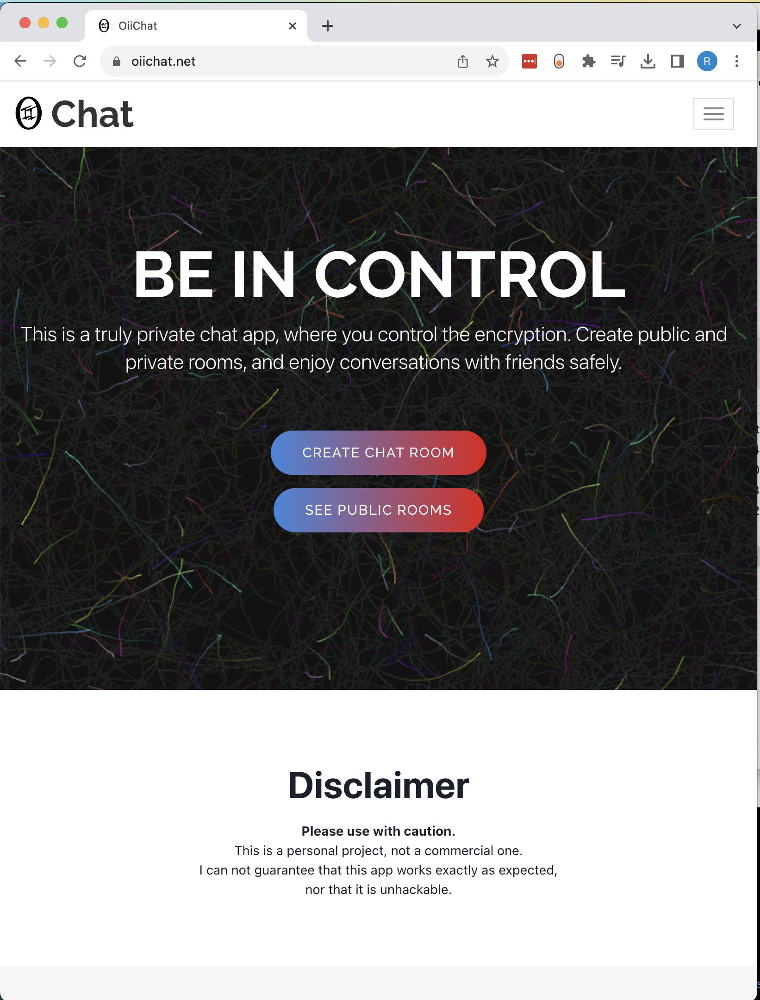

# (Private!) Chat app

This app is live: https://oiichat.net (**note: the server has been turned off, due to the associated cost**). However, this is a personal project, not a commercial one. Use it at your own discretion.

### Table of contents:

- [(Private!) Chat app](#private-chat-app)
    - [Table of contents:](#table-of-contents)
    - [Features](#features)
  - [Tech Stack](#tech-stack)
  - [Read more](#read-more)

### Features 

Long story short, this is a pet project chat app that:
* allows users to create public and private rooms
* private rooms are encrypted, on the client side, using an encryption key set by the user
  * this makes it impossible for the server to read the original messages
* chat features:
  * 1-1
  * group chats
  * "user is typing" feature
  * "online users" feature
  * "vault" to save rooms password (they are encrypted using your password, so once again the server can not read them) 

## Tech Stack

- Frontend
  - React
  - S3 + Cloudfront
- Backend
  - NodeJS, Express and Socket.io
  - Mongodb
  - ECS Fargate

## Read more 
To read more about this app, please see [this document](./PrivateChatApp.md)