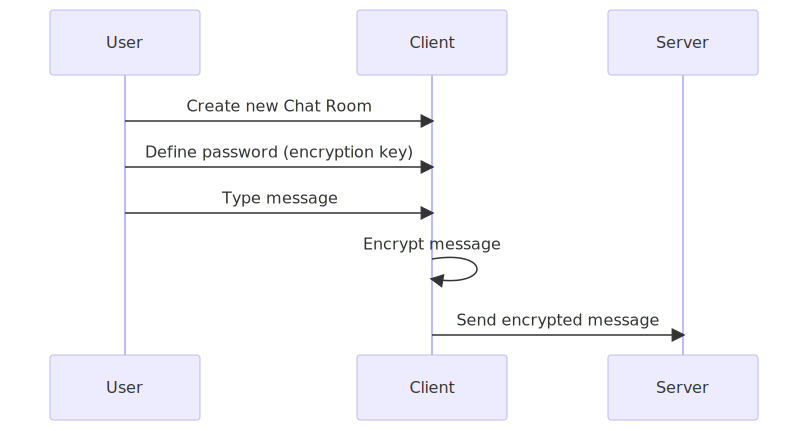

The goal of this document is to explain why I built this project, and to detail exactly how it works, particularly when it comes to the encryption feature, which is the main difference between this app and most other chat apps out there.

So, let's jump right in.

## Motivation

WhatsApp is end-to-end encrypted, right? So... does this mean that WhatsApp can't read your messages?

Honestly, this is a question that I would like someone smarter than me to try to answer. But, the way I see it is: WhatsApp (and other apps like it) control the encryption key used to encrypt your message. And because of this, this means that WhatsApp **can** ready your messages. As a user, you (and me) are trusting WhatsApp not to do it, but they could. (Once again, please, if I am wrong about this, please do let me know and point me to some documentation which explains that this is not the case and why that is so.)

So, the question that followed after that was: is it even possible to build a ChatApp that that is encrypted AND can not not be accessed by the chat service provider? And if so, what would that look like?

Initially, thinking about this, I thought that: "no, it is not possible to build such an application". I though that, "even if the app allows the user to select their own encryption key, the user still has to type this password inside a form that is controlled by the chat service provider, and this means that the chat service provider can read this encryption key, and abuse it, if they so desire".

After thinking some more, I added this: "While this may be true, if the user can verify that their encryption key is not being sent to the server, then they can be sure that the chat service provider is not able to read the encrypted messages".

And thus, this project was born. So, now, let's explore exactly what I build, how it is different from most chat apps, and how you can verify this by yourself, so that you don't have to trust me (or WhatsApp).


So, then the question is: does this mean that WhatsApp can not read your messages? Or listen to your microphone?
If that's the case, why are there so many people complaining about WhatsApp reading their messages and showing advertisements to things they only ever mentioned in WhatsApp?

Well, I don't have the full answer to this, but I believe that the "end-to-end" encryption that WhatsApp offer does NOT guarantee that WhatsApp can not read your messages. Why? Because WhatsApp is the one who controls the encryption key. And if they control the encryption key, that means that they CAN read your messages. 

So, this project was built with the following motivation. Is "real end-to-end encryption even possible"? That is, can a Chat provider offer a service with the guarantee that they are not able to read your messages? That is what I wanted to answer, and, I'm looking forward to hearing your thoughts, but I think I did.

Besides that, this app was also motivated by the fact that I honestly never worked with web sockets before, and I was really interested in learning more about it.

## Solution overview

As I mentioned in the *Motivation* section, if a chat provider has the encryption key, then they are able to read your encrypted messages. So, if I want to build a service that is not able to read your messages, the solution is obvious, right? I need to build a chat app in such a way that: 
    - you, the user, decide and control the encryption key
    - and I, the chat service provider, am not able to read this key

However, there is one problem: if I build an application that presents you a form to type in a string to be used as an encryption key, then surely I can read the contents of the form, and steal your encryption key, right? Yes, I believe that is right. But, there is a caveat:
    - as long as the encryption key is never passed to the chat provider servers, then your encryption key is safe

So, then the question becomes: how can you, the user, be sure that the server is not storing your encryption key?

I believe that the answer to that is: transparency. 
That is, every request that is made from the frontend service to the backend is monitored by your web browser, and can be inspected. This is true for both HTTP requests and also for any communication that happens over sockets.

In practice, this means that any user can take advantage of the browser console to inspect every request that is made to the backend. This way, the user can check the payload of each of those requests, and also verify that the encryption key that they have selected is NOT being sent to the server.

To finalize this brief overview, let us point out that: the user defined encryption key is used to encrypt every chat message, on the client side, before being sent to the server. This means two things:
    - 1. the server only stores encrypted messages
    - 2. the server does NOT have the encryption key to decrypt these user messages

```
sequenceDiagram
    participant User
    participant Client
    participant Server
    User->>Client: Create new Chat Room
    User->>Client: Define password (encryption key)
    User->>Client: Type message
    Client->>Client: Encrypt message
    Client->>Server: Send encrypted message
```




## 